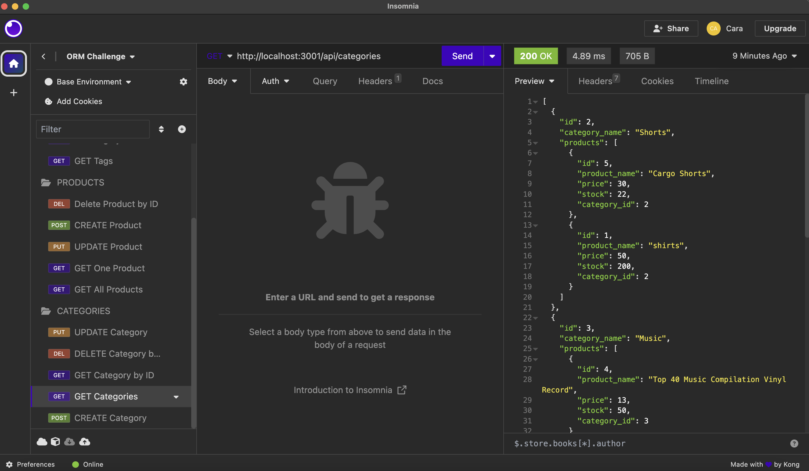
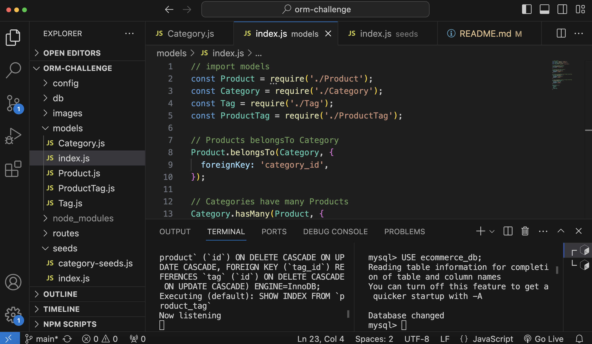

# E-commerce Back End Application

## Description

The E-commerce Back End Application is designed for users to be able to test routes in Insomnia. Utilizing Insomnia, the routes can return all categories, products, and tags. The routes can return a single category, a single product, and a single tag. Users can delete categories, products, and tags by id. They are also able to update categories, products, and tags by id. Lastly, users can create their own categories, products, and tags.

## Installation

No installation necessary.

A demo of the application is below:
[ORM Application Demo Video](https://drive.google.com/file/d/1vqUcPfsp0G0_3NMR9XyZIBaqzW3RW_04/view)

A screenshot of a route in Insomnia is below:

A screenshot of my VS Code is below:

## Credits

The teacher and a TA noticed that I had two ports in use which were causing an error. I deleted it based on their advice. This code was deleted in server.js. The teacher noticed that my Product foreign key and Tag foreign key were wrong. I respectively changed the foreign keys to product_id and and tag_id. This code can be found in the folder models in the file index.js. The teacher noticed that the seedTags and seedProductTags were commented out. I uncommented out those lines of code per his reccomendation. The uncommented code can be found under the folder seeds in the file index.js.

## License

No license is applied to this application.